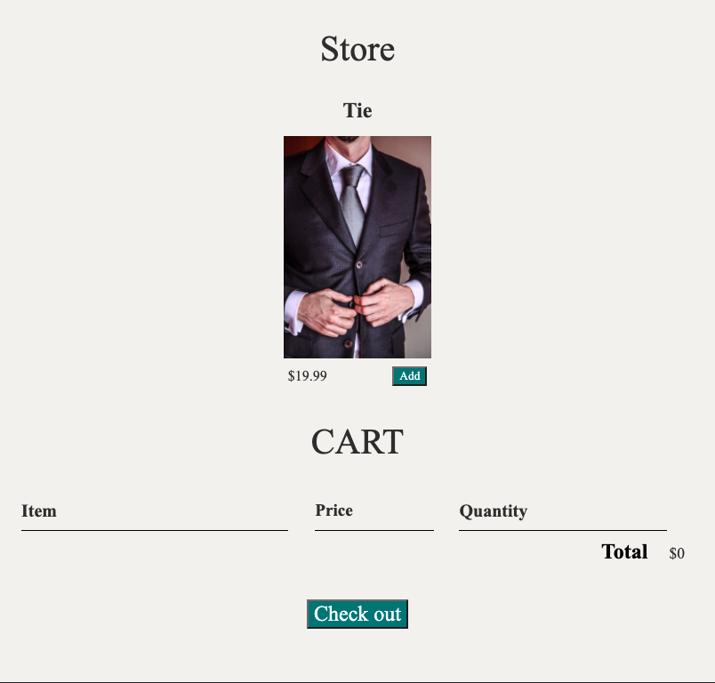

# shopping-cart
## JavaScript code for front-end ecommerce store
* Site published at: https://tannerlsmith.github.io/shopping-cart/
* Uses front-end JavaScript. Specifically, I used on click events to change the price, add items to the cart, and delete.

